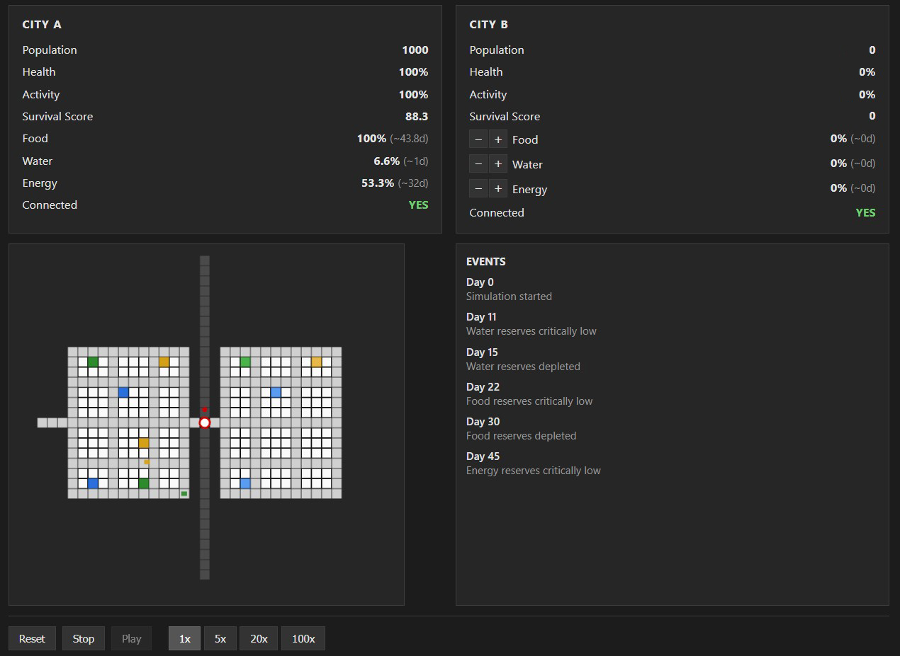

# N.E.M.O.

> **Not Exactly a Model Of a World**

N.E.M.O. is an independent side project exploring how a digital environment can evolve from simple simulation toward adaptive prediction.

N.E.M.O. draws inspiration from ongoing research in simulation, world models, predictive systems, and machine intelligence.

---

## Overview

The project starts with a deliberately simple urban world governed by transparent rules.

Instead of focusing on realism, the goal is to study how systems react to disruption, isolation, growth, decline, and structural change.

At its core, N.E.M.O. investigates a simple question:

> Can a system learn to anticipate and adapt to change before collapse occurs?

The first stage focuses on deterministic simulation: a world where events unfold according to known rules and predictable consequences.

Future stages explore a different challenge: generating and evaluating possible futures, identifying alternative paths, and searching for viable adaptations when the environment changes.

---

## Research Areas

N.E.M.O. sits at the intersection of:

* Urban Systems
* Simulation
* Complex Networks
* Artificial Intelligence
* World Modeling
* Decision Support

---

## About

N.E.M.O. is an independent side project developed alongside professional work and personal research interests.

It serves as a long-term experimental playground to explore simulation, world modeling, urban systems, artificial intelligence, and adaptive decision-making.

The project evolves incrementally through prototypes, experiments, and iterative research rather than following a traditional product roadmap.

---

## Current Status

**Research & Prototype Development**

The project is currently focused on building and validating its foundational simulation layer before expanding toward prediction and adaptation capabilities.

---

## Long-Term Vision

A system capable of:

* Understanding the state of a simplified world
* Exploring possible futures
* Evaluating consequences of interventions
* Discovering alternative solutions to emerging problems
* Supporting human decision-making through simulation and prediction

---

## Repository Scope

This repository is a public overview of the project.

Technical implementation details, research experiments, and active development remain private while the project continues to evolve.

---

## Disclaimer

N.E.M.O. is an experimental research project and should not be considered a real-world planning, forecasting, or decision-making tool.
